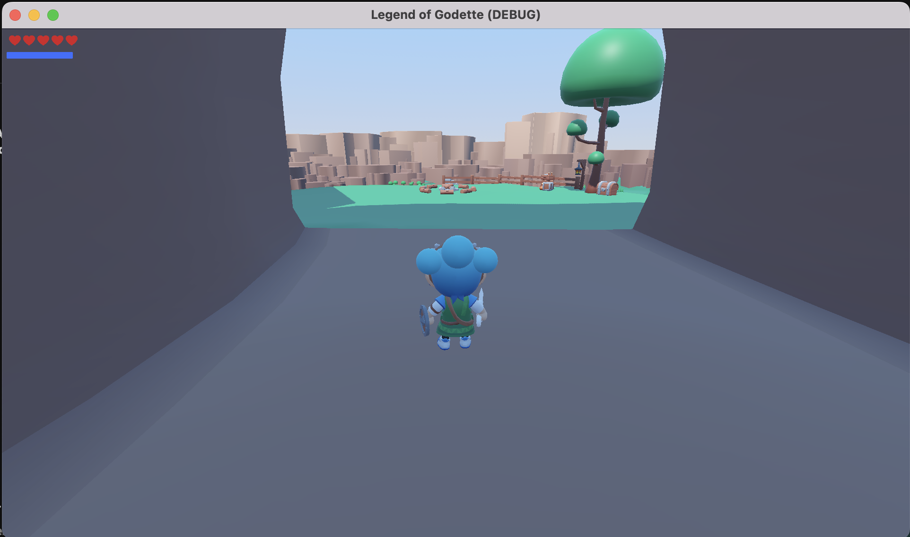
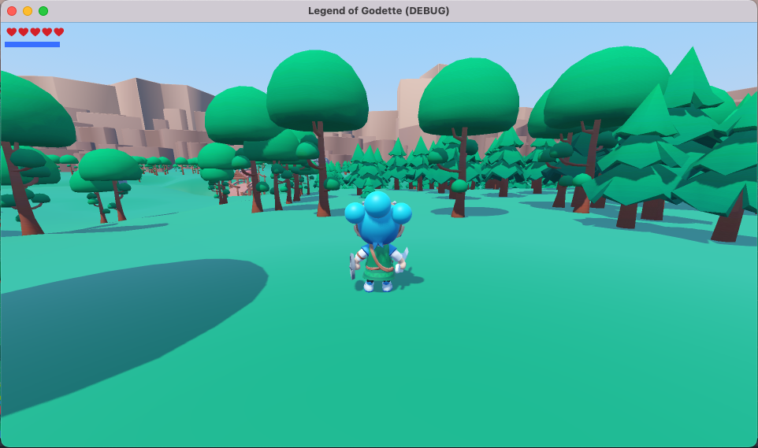
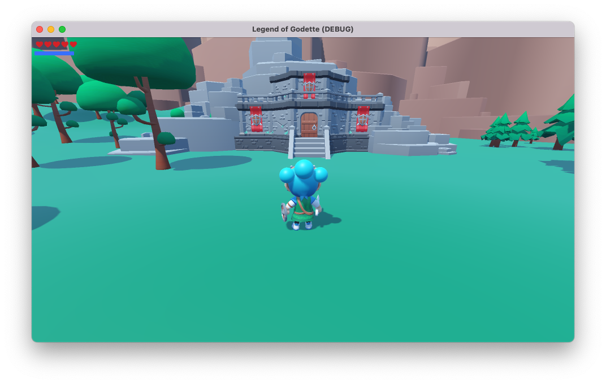
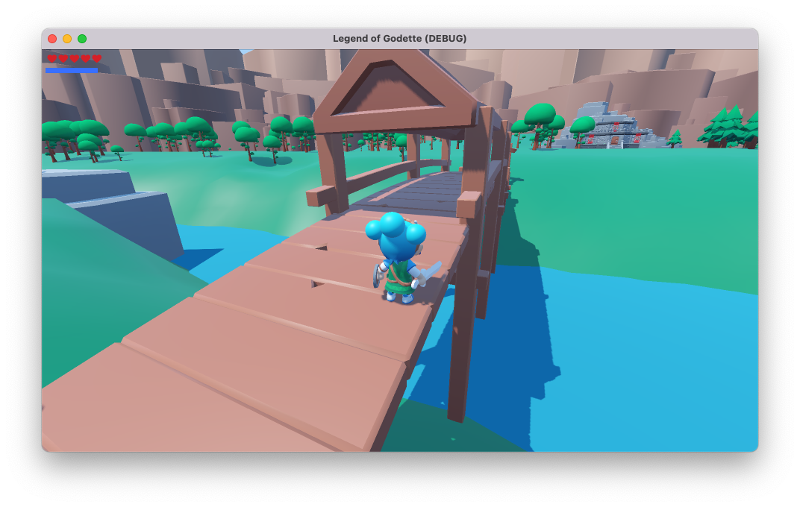
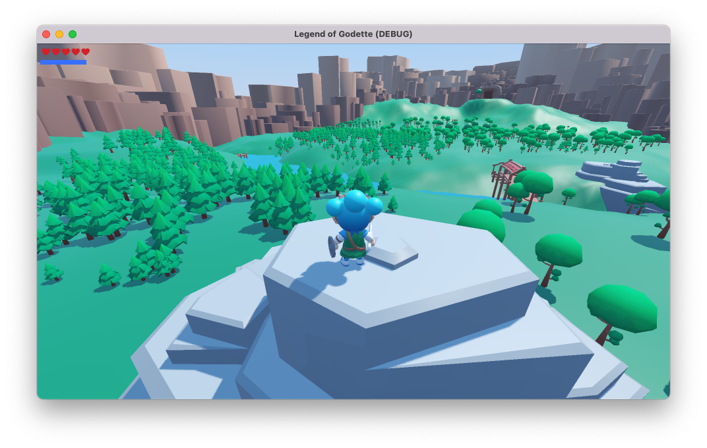
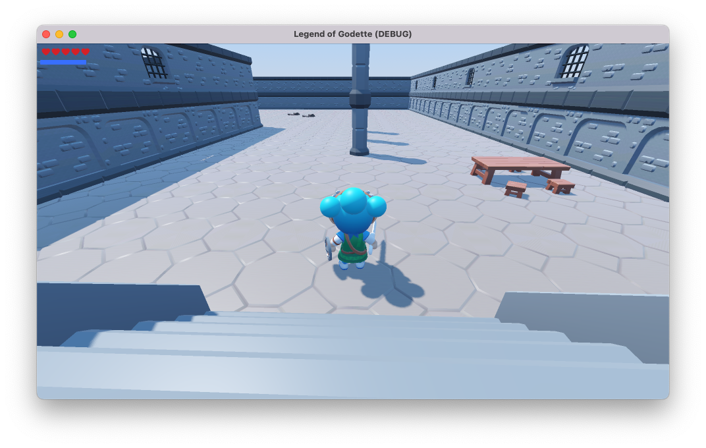
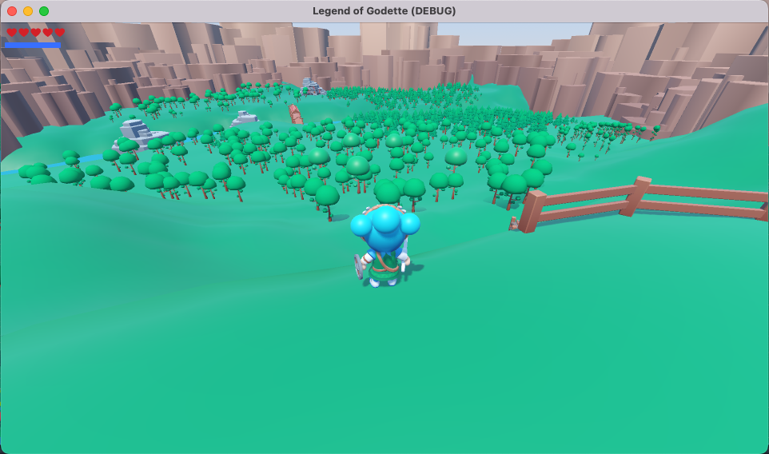
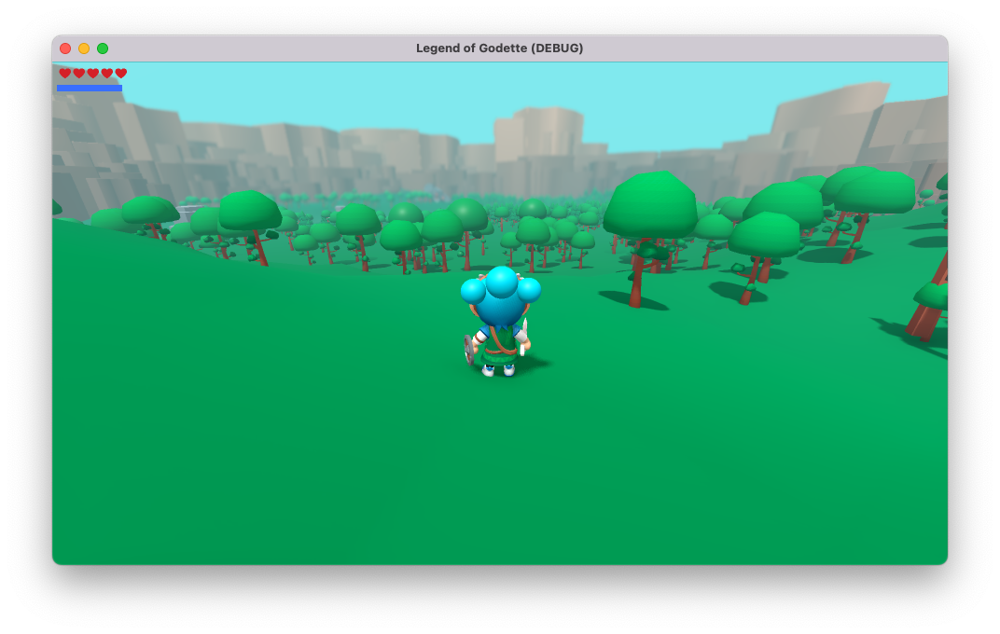

# Legend of Godette

A [Breath of the Wild](https://www.zelda.com/breath-of-the-wild/) inspired action-adventure game built in [Godot 4.5](https://godotengine.org/), following the tutorial series [Recreating Zelda: Breath of the Wild in Godot](https://www.youtube.com/watch?v=AoGOIiBo4Eg).

## Features

- Third-person character controller with animation tree
- Combat system with melee weapons
- Health system
- Sound effects, footstep audio with randomised pitch, and background music
- Overlay shader applied to enemies and player character
- Texture-driven tree spawner — a custom tool that reads a texture and uses it as a placement map to scatter trees across the terrain

## Running

Open the project in Godot 4.5 and run the main scene.

## Screenshots

| | |
|---|---|
|  |  |
|  |  |
|  |  |
|  |  |
